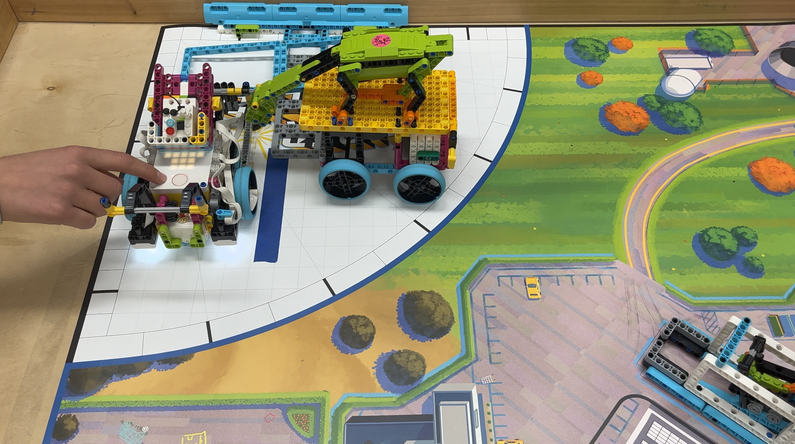

# πrats 2022

> Team # 34612
Santa Barbara Middle School

Below is our robot that scores 285 points. The youtube video linked below shows the sequence of missions runs. The Python scripts in order are:

1. mission_tv_gyro
2. forward
3. backward
4. innovandwater

[πrats 2022 - Super Powered - Full robot run youtube video](https://youtu.be/iIuyL_8K07Y)

